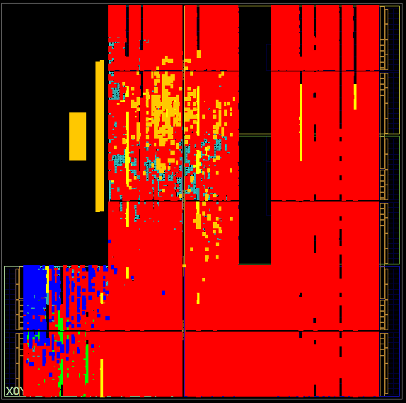

# S4D_PTB_XL_UltraTiny

S4D accelerator for 12-lead ECG classification (PTB-XL, 5 diagnostic
superclasses: CD, HYP, MI, NORM, STTC) on a Zynq-7020 (`xc7z020clg400-1`,
Red Pitaya), FCLK0 = 64 MHz.

| Folder | Content |
|---|---|
| `create_project.tcl` | Rebuilds the Vivado project from the files in this folder |
| `rtl/` | Verilog sources, one module per file named after the module (module references of the block design) |
| `mem/` | ROM initialisation files read by `$readmemh` at synthesis: encoder, final affine, classifier, GELU and sigmoid LUTs |
| `python/` | Training, quantization and export of the weights |
| `board_test/` | C test program for the board, weight stream and labels |
| `testbench/` | Self-checking RTL testbenches of the encoder, the decoder and the S4D core, with their reference models (section 5) |
| `docs/` | Post-implementation floorplan and the Tcl script that colours it |

## 1. Rebuild the Vivado project

Requires **Vivado 2025.2**.

```
vivado -mode batch -source create_project.tcl
```

The weights of the six S4D layers are **not** in the bitstream: they are
streamed at run time through `axi_dma_0` (see `board_test/`).

## 2. Python: training, quantization, weights

Tested on Linux / WSL2 with Python 3.10 and an NVIDIA GPU
(`pip install -r python/requirements.txt`). All commands are run from
`python/`.

**Dataset.** PTB-XL v1.0.3, 100 Hz records only (~600 MB), into
`python/data_ptbxl/`:

```
cd python
aws s3 sync --no-sign-request s3://physionet-open/ptb-xl/1.0.3/ data_ptbxl/ \
    --exclude "records500/*"
```

(or download it from https://physionet.org/content/ptb-xl/1.0.3/).

**Pipeline.**

| Step | Command | Output |
|---|---|---|
| 1. Training | `python Train_s4d_ecg.py` | `experiments/exp_<date>_ecg100_l1024_fixed_multi/` (`best.pt`, `report.json`) |
| 2. Quantization + bit-accurate check | `python Quantize_s4d_ecg.py [experiment folder]` | `<experiment>/quant_<date>_hw/mem/` (all `.mem` + `quant_report.json`) |
| 3. Board files | `python export_board_files.py --mem <experiment>/quant_<date>_hw/mem` | `../board_test/w_stream_ECG.bin`, `samples_2158ECG.bin`, `labels_2158ECG.bin` |

After step 2, copy the 12 ROM files used by Vivado (`cls_*`, `enc_*`,
`l0_bn_*`, `l0_s4d_bout`, `l0_s4d_wout`, `l6_bn_*`, `gelu_lut`,
`sigmoid_lut`) from the quantization folder into `../mem/` and rebuild the
bitstream (section 1).

Quantization uses the fixed-point formats of the synthesized hardware
(`HW_LOCK = True` in `Quantize_s4d_ecg.py`).

**Bit-accurate golden model.** Three modules, shared by every script, mirror
the RTL bit for bit (fixed-point formats, Jury clamp of the biquad
coefficients, `.mem` packing):

| Module | Content |
|---|---|
| `gen_s4d_mem.py` | Fixed-point formats of the datapath, S4D -> biquad conversion (ZOH), Jury clamp, bit-accurate model of one S4D layer |
| `s4d_export.py` | Quantization, `.mem` packing, bit-accurate model of the full chain, range calibration |
| `s4d_bn.py` | BatchNorm variant of the model (the one in hardware): folding, quantization and export of the affine layers |

`Train_and_quantize_s4d_sCIFAR.py` trains and quantizes the sCIFAR-10 model
with the same golden model; it is included to reproduce the sCIFAR-10
bit-accurate result (section 4).

Preprocessing (in `Train_s4d_ecg.preprocess`): 100 Hz, per-lead median
removal, one fixed scale for the whole dataset (SCALE = 1.8083 /mV for the
provided weights, calibrated on the training folds and saved as
`input_scale` in `quant_report.json`), Q5.11, 1000 samples + 24 zeros =
L 1024.

**Board stimuli without training.** To test the provided bitstream and
weights, only the dataset is needed:

```
python export_board_files.py
```

writes `../board_test/samples_2158ECG.bin` and `labels_2158ECG.bin` from the
raw 100 Hz records (no GPU needed). SCALE is recomputed from the
training folds with the same fixed seed, which reproduces the value used in
training exactly; it can also be forced with `--scale`. Verified to be
byte-identical to the files used on the board.

## 3. Test on the board

`board_test/s4d_PTB_XL_2158ECG.c` runs the 2158 fold-10 records through the
accelerator from Linux userspace (`/dev/mem`, DMA) and prints the per-class
and macro AUC (one-vs-rest, the standard PTB-XL "superdiagnostic" protocol).

Files needed in the working directory on the board:
`w_stream_ECG.bin` (provided), `samples_2158ECG.bin` and
`labels_2158ECG.bin` (generate both with `python export_board_files.py`,
see section 2; the labels are also provided). `samples_2158ECG.bin` is 53 MB
and is not stored in the repository.

Before running it, set FCLK0 to 64 MHz (the Red Pitaya boots at 125 MHz) and
reserve DDR at `0x1D000000` (`mem=464M` in the boot arguments).

```
gcc -O2 -o s4d_PTB_XL_2158ECG s4d_PTB_XL_2158ECG.c
sudo ./s4d_PTB_XL_2158ECG
```

Expected macro AUC with the provided weights: **0.9244** (CD 0.9136,
HYP 0.8982, MI 0.9314, NORM 0.9471, STTC 0.9317), identical to the
bit-accurate model (section 4).

## 4. Results

Accuracy of the floating-point model, the bit-accurate model and the IP core
on the board:

| Task (metric) | Float | Bit-accurate | Board |
|---|:---:|:---:|:---:|
| sCIFAR-10 (accuracy) | 76.37% | 76.40% | 76.40% |
| PTB-XL (macro-AUC) | 0.9255 | 0.9244 | 0.9244 |

The bit-accurate model and the board give the same result: the RTL
reproduces the golden model exactly.

### Floorplan

Post-implementation placement on the Zynq-7020 (`xc7z020clg400-1`):
encoder in green, S4D core in red, decoder in blue, AXI DMA and PS7 in
orange.



## 5. RTL testbenches

`testbench/` holds one self-checking testbench for each of the three IP
cores of the block design. They are plain Verilog-2001, need no Vivado
licence and were run with [Icarus Verilog](https://steveicarus.github.io/iverilog/)
13.0. The last line printed is `PASS` or `FAIL`. Comments and messages are in
Italian.

| Folder | Module under test | Test vectors |
|---|---|---|
| `encoder_tb/` | `s4d_encoder_ecg_axis` | Hand-readable: 10 time steps of 12 leads, selector weights. Every output word encodes time step, lead and channel in its hex digits |
| `decoder_tb/` | `s4d_decoder_axis` | 4 sequences: two with logits readable in decimal, one placed exactly on the rounding thresholds, one random at full scale (saturations) |
| `core_tb/` | `s4d_core_axis` | The trained weights of the six layers (`board_test/w_stream_ECG.bin`) and the two LUTs of `mem/`, with 2 random input sequences |

Each folder contains:

- Python scripts that generate the `.mem` files (stimulus, weights, biases);
- a reference model (`encoder_model.py`, `decoder_model.py`,
  `core_model.py`) that recomputes the expected output with integer
  arithmetic, reading the same `.mem` files as the RTL. The models are
  written from the RTL and are independent of the golden model of
  `python/`;
- the testbench (`tb_*.v`), which compiles the sources of `rtl/`.

Every testbench sends the stimulus twice, with a reset in between: first at
full speed, then with random pauses on the inputs (`tvalid` low) and random
stalls on the output (`tready` low). Each output word is compared with the
reference model, together with `tlast`, the number of words and the error
flags of the module. The stall probabilities and the random seed are
parameters at the top of each testbench and can be overridden with
`-P<testbench>.<PARAMETER>=<value>`.

**Run.** The generated `.mem` files are stored in the repository, so Python
is not needed to run the simulations. From each folder:

```
cd testbench/encoder_tb
iverilog -g2001 -s tb_s4d_encoder_ecg_axis -o tb_encoder.vvp \
    tb_s4d_encoder_ecg_axis.v ../../rtl/s4d_encoder_ecg_axis.v
vvp tb_encoder.vvp
```

```
cd testbench/decoder_tb
iverilog -g2001 -s tb_s4d_decoder_axis -o tb_decoder.vvp \
    tb_s4d_decoder_axis.v ../../rtl/s4d_decoder_axis.v ../../rtl/s4d_decoder.v \
    ../../rtl/s4d_affine.v ../../rtl/s4d_meanpool.v ../../rtl/s4d_classifier.v
vvp tb_decoder.vvp
```

```
cd testbench/core_tb
iverilog -g2001 -s tb_s4d_core_axis -o tb_core.vvp \
    tb_s4d_core_axis.v ../../rtl/s4d_core_axis.v ../../rtl/s4d_wload_axis.v \
    ../../rtl/s4d_seqbuf.v ../../rtl/s4d_layer.v ../../rtl/s4d_affine.v \
    ../../rtl/s4d_biquad_bank.v ../../rtl/s4d_biquad_unit.v ../../rtl/s4d_pwl.v \
    ../../rtl/s4d_mixing_glu.v
vvp tb_core.vvp
```

`vvp` must be run from the testbench folder: the modules and the testbench
read the `.mem` files from the working directory. The encoder and decoder
simulations take about a second, the core about two minutes.

Expected last line:

| Testbench | Output |
|---|---|
| Encoder | `PASS: 1280 dati corretti in ognuna delle 2 fasi` |
| Decoder | `PASS: 24 parole corrette (4 pacchetti) in ognuna delle 2 fasi` |
| Core | `PASS: 2048 campioni corretti (2 sequenze) in ognuna delle 2 fasi` |

**Regenerate the vectors.** Python 3, standard library only. The reference
model must be run last, because it reads the files written by the other
scripts:

| Folder | Order |
|---|---|
| `encoder_tb/` | `gen_encoder_stimulus.py`, `weight_gen.py`, `bias_gen.py`, `encoder_model.py` |
| `decoder_tb/` | `weight_gen.py`, `bias_gen.py`, `gen_decoder_stimulus.py`, `decoder_model.py` |
| `core_tb/` | `weight_gen.py`, `gen_core_stimulus.py`, `core_model.py` |

**Configuration under test.** The modules are instantiated with the
parameters of the block design (encoder: defaults; decoder: `K = 5`,
`BN_SH = 13`; core: `F_SSM = 9`), except for the sequence length of the
decoder and of the core, which is reduced from `L = 1024` to `L = 8`. In
the decoder a short sequence makes a skipped or repeated time step visible
in the mean; in the core a full sequence takes about 4 million clock cycles.
`L` only sets the length of the counters, the depth of the sequence buffer
and the shift of the mean.

**Not covered.** `L = 1024`; saturation and rounding in the encoder; the
`err_frame` flag of the encoder, the `ERR_LEN` / `ERR_OVR` flags and the
`STREAM_LOGITS = 0` mode of the decoder, and the `status_err` flags of the
core, which are only checked to stay low; equal logits in the class
selection. The full chain on real records is covered by the board test
(section 3).
